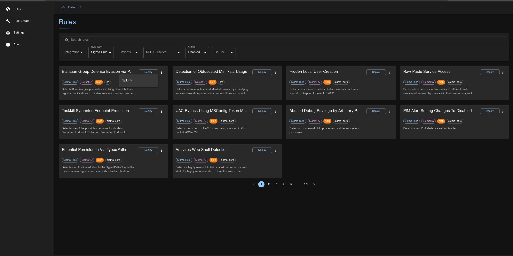
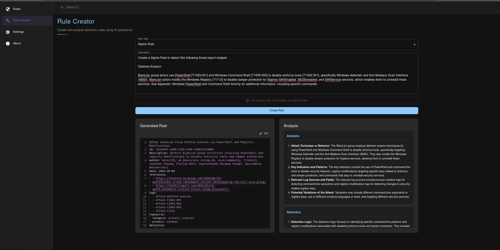
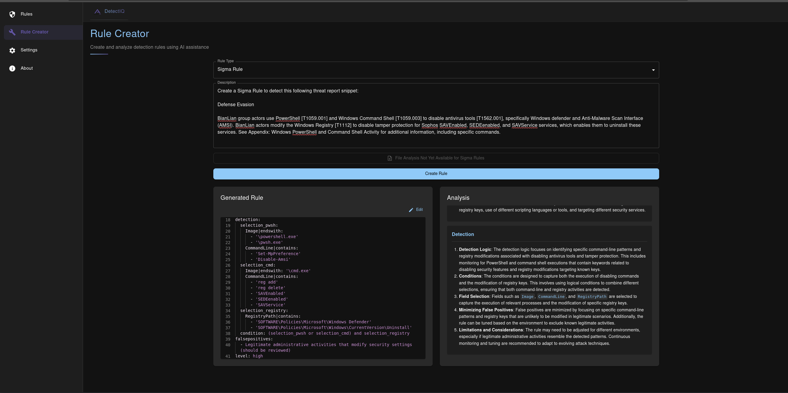
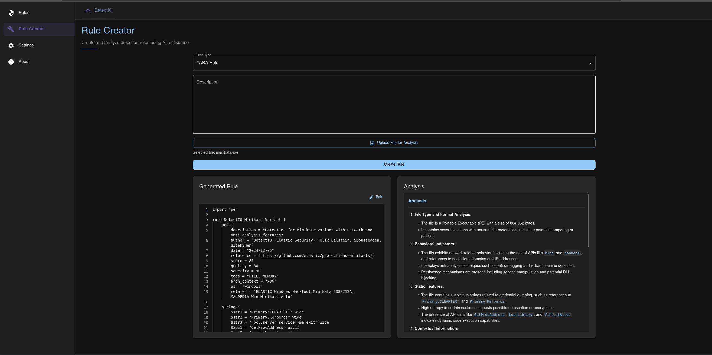
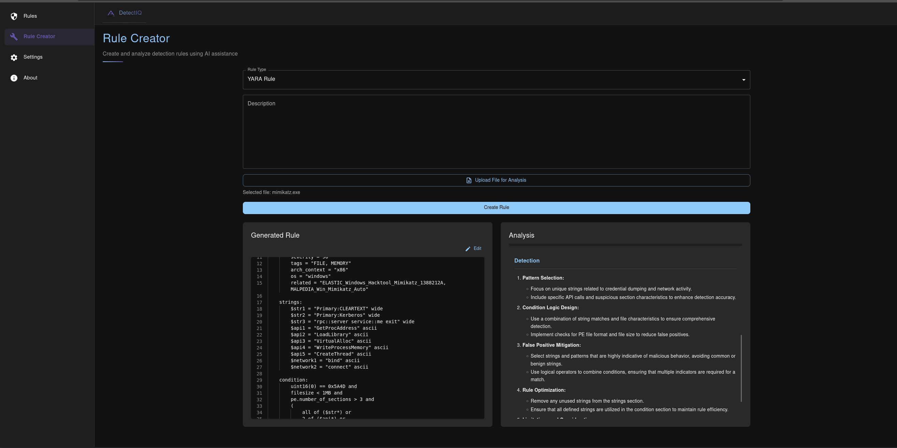
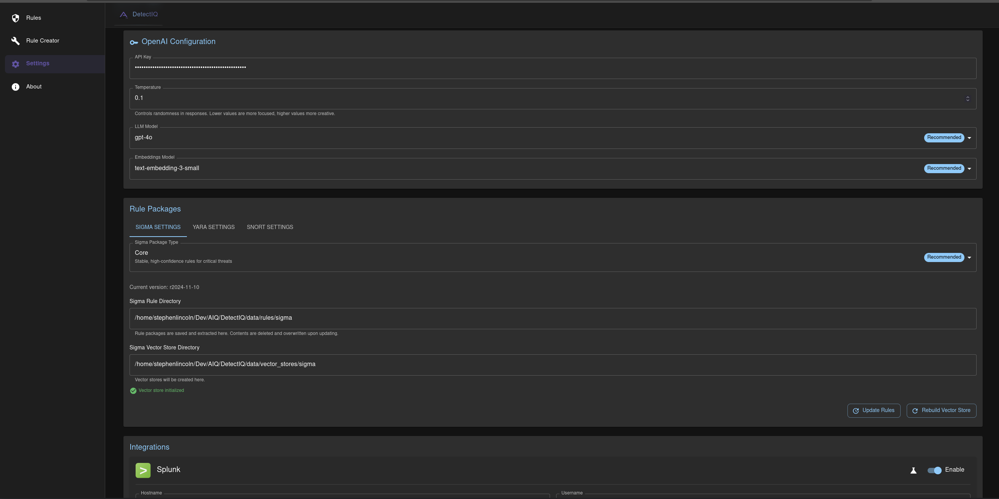
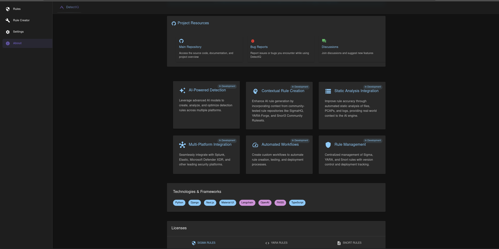

# DetectIQ

> ⚠️ **IMPORTANT DISCLAIMER**
> 
> This project is currently a **Proof of Concept** and is under active development:
> - Features are incomplete and actively being developed
> - Bugs and breaking changes are expected
> - Project structure and APIs may change significantly
> - Documentation may be outdated or incomplete
> - Not recommended for production use at this time
> - Security features are still being implemented
> 
> We welcome all feedback and contributions, but please use at your own risk!

DetectIQ is an AI-powered security rule management platform that helps create, analyze, and optimize detection rules across multiple security platforms.  It can be used with the provided UI, or just with Python scripts using the self contained `detectiq/core` module.  See examples in the `detectiq/examples` directory for more information.

[](https://www.python.org/downloads/)
[](https://www.gnu.org/licenses/lgpl-2.1)
[]()

- [DetectIQ](#detectiq)
  - [Current Features](#current-features)
    - [AI-Powered Detection](#ai-powered-detection)
    - [Rule Repository Integration](#rule-repository-integration)
    - [Static Analysis Integration](#static-analysis-integration)
    - [Multi-Platform Integration](#multi-platform-integration)
  - [Planned Features](#planned-features)
  - [Getting Started](#getting-started)
    - [Prerequisites](#prerequisites)
    - [Installation](#installation)
    - [Initial Setup](#initial-setup)
    - [Configuration](#configuration)
    - [Start Development Servers](#start-development-servers)
  - [Project Structure](#project-structure)
  - [Screenshots](#screenshots)
    - [Rule Dashboard with Splunk Deployment Option](#rule-dashboard-with-splunk-deployment-option)
    - [Sigma Rule Creation](#sigma-rule-creation)
    - [YARA Rule Creation](#yara-rule-creation)
    - [Settings Page](#settings-page)
    - [About Page](#about-page)
  - [Contributing](#contributing)
  - [License](#license)
  - [Support \& Community](#support--community)
  - [Acknowledgments](#acknowledgments)


## Current Features

### AI-Powered Detection 
- Create and optimize detection rules using OpenAI's LLM models
- Intelligent rule suggestions based on context and best practices
- Automated rule validation and testing 
- Upload malware samples and PCAP files for static analysis, automatically adding context for YARA and Snort rule creation
- LLM Rule creation analysis and detection logic returned in the rule creation response

### Rule Repository Integration 
- Enhanced by community-tested repositories:
  - SigmaHQ Core Ruleset
  - YARA-Forge Rules
  - Snort3 Community Ruleset
- Automatically check and update repositories with rule changes
- Vectorize rules for efficient similarity comparison for more context-aware rule creation engine

### Static Analysis Integration 
- Automated file analysis for YARA rules
- PCAP analysis for Snort rule creation
- Implicit log analysis for Sigma rule optimization (Explicit Analysis Coming Soon)

### Multi-Platform Integration 
- Automatic Sigma rule translation to various SIEM queries using `pySigma` and `SigmAIQ` wrapper
- Seamlessly create Splunk Enterprise Security correlation rules from Sigma rules

## Planned Features
- Custom/local LLM models, embeddings, and vector stores
- More integrations with SIEMs such as Elastic and Microsoft XDR
- Explicit log analysis for Sigma rule optimization
- Rule testing and validation
- Rule searching, e.g. "Do I have a rule in place that can detect this?"
- Deployment tracking and workflow automation
- Rule management UI Enhancements
- Authentication and Authorization
- Project refactoring for production readiness
- Chatbot (langchain agents) UI with memory
- Docker containerization and deployment
- Rule management without OpenAI requirements
- More non-webapp examples

## Getting Started

### Prerequisites
- Python 3.9 or higher
- Node.js 16+
- Poetry for dependency management (optional, but recommended)

### Installation

```bash
# Clone the repository
git clone https://github.com/slincoln-aiq/DetectIQ.git

# Install Python dependencies
poetry install --all-extras

# Install frontend dependencies
cd detectiq/webapp/frontend
npm install

# Set up environment
cp .env.example .env
# Edit .env with your settings
```

### Initial Setup

#### Database Setup
```bash
# Create and apply migrations
cd detectiq/
python manage.py migrate

# Initialize rulesets with vector stores
python manage.py initialize_rulesets --create_vectorstores

# Or initialize specific rule types
python manage.py initialize_rulesets --rule_types sigma yara
python manage.py initialize_rulesets --rule_types snort --force
```

#### Maintenance Commands
```bash
# Delete all rules (use with caution)
python manage.py delete_all_rules --dry-run  # Preview what will be deleted
python manage.py delete_all_rules --rule-type sigma  # Delete specific rule type
python manage.py delete_all_rules  # Delete all rules

# Delete only LLM-generated rules
python manage.py delete_llm_rules --dry-run  # Preview
python manage.py delete_llm_rules  # Execute deletion
```

The initialization process will:
1. Set up the database schema
2. Download official rule repositories
3. Create necessary directories
4. Generate embeddings for rule search (if --create_vectorstores is used)
5. Normalize rule metadata

> **Note**: Initial vector store creation may take some time depending on the number of rules and your hardware. Use the `--rule_types` flag to initialize specific rulesets if you don't need all of them.

### Configuration

Set the required environment variables in the `.env` file.  See the `.env.example` file for more information.  You can also set the optional environment variables to customize the behavior of the application, or rely on the defaults in `detectiq/globals.py`.  You can also set and update settings in the webapp UI, if using the webapp.

#### Required environment variables:
```bash
OPENAI_API_KEY="your-api-key"
DEBUG=True
DJANGO_SECRET_KEY=django-insecure-your-secret-key-here
```

#### Optional environment variables:
```bash
# Rule Directories, defaults to $PROJECT_ROOT/data/rules if not specified
SIGMA_RULE_DIR="path/to/sigma/rules"             # Directory for Sigma rules
YARA_RULE_DIR="path/to/yara/rules"              # Directory for YARA rules
SNORT_RULE_DIR="path/to/snort/rules"            # Directory for Snort rules
GENERATED_RULE_DIR="path/to/generated/rules"     # Directory for AI-generated rules

# Vector Store Directories, defaults to $PROJECT_ROOT/data/vector_stores if not specified
SIGMA_VECTOR_STORE_DIR="path/to/sigma/vectors"   # Vector store for Sigma rules
YARA_VECTOR_STORE_DIR="path/to/yara/vectors"     # Vector store for YARA rules
SNORT_VECTOR_STORE_DIR="path/to/snort/vectors"   # Vector store for Snort rules

# LLM Configuration
LLM_MODEL="gpt-4o"                              # LLM model to use (default: gpt-4o)
LLM_TEMPERATURE=0.10                            # Temperature for LLM responses
EMBEDDING_MODEL="text-embedding-3-small"         # Model for text embeddings

# Package Configuration
SIGMA_PACKAGE_TYPE="core"                       # Sigma ruleset type (default: core)
YARA_PACKAGE_TYPE="core"                        # YARA ruleset type (default: core)
```

### Start Development Servers

> **Note**: You must have both the frontend and backend servers running to use the webapp.
> 
> Navigate to http://localhost:3000/ to access the webapp UI after starting the servers.

#### With VSCode

Under Run/Debug, select the "Full Stack" configuration and click the green play button.

#### With Terminal

```bash
# Start frontend development server
cd detectiq/webapp/frontend
npm run dev

# Start backend development server
cd detectiq/
python manage.py runserver
```


## Project Structure

```
DetectIQ/
├── detectiq/
│   ├── core/                 # Core functionality
│   ├── licenses/            # License files
│   ├── llm/                 # LLM integration
│   │   ├── agents/         # LangChain agents
│   │   └── tools/          # Custom tools
│   └── webapp/             # Web application
│       ├── frontend/       # Next.js frontend
│       └── backend/        # Django backend
├── tests/                  # Test suite
└── poetry.lock            # Dependency lock file
```

## Screenshots

### Rule Dashboard with Splunk Deployment Option
<p align="center">
  
  <br>
  <em>Rule Dashboard with Splunk Deployment Option</em>
</p>

### Sigma Rule Creation
<p align="center">
  
  
  <br>
  <em>Sigma Rule Creation from threat report snippet</em>
</p>

### YARA Rule Creation
<p align="center">
  
  
  <br>
  <em>YARA Rule Creation using file analysis from uploaded mimikatz.exe sample</em>
</p>

### Settings Page
<p align="center">
  
  <br>
  <em>Settings Page</em>
</p>

### About Page
<p align="center">
  
  <br>
  <em>About Page</em>
</p>

## Contributing

1. Fork the repository
2. Create a feature branch
3. Commit your changes
4. Push to the branch
5. Create a Pull Request

## License

This project uses multiple licenses:
- Core Project: LGPL v2.1
- Sigma Rules: Detection Rule License (DRL)
- YARA Rules: YARAForge License
- Snort Rules: GPL with VRT License

## Support & Community

- Join our [SigmaHQ Discord](https://discord.gg/27r98bMv6c) for discussions
- Report issues via GitHub Issues

## Acknowledgments

- SigmaHQ Community
- YARA-Forge Contributors
- Snort Community
- OpenAI for GPT-4o Integration

